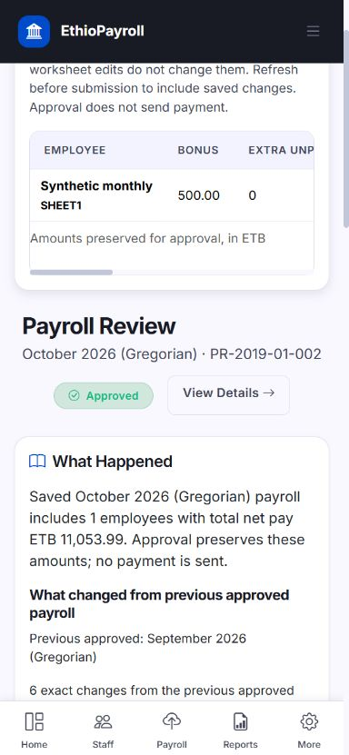
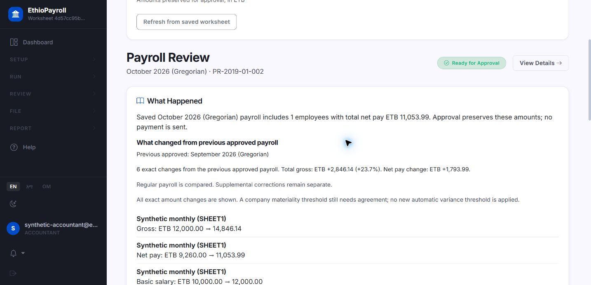
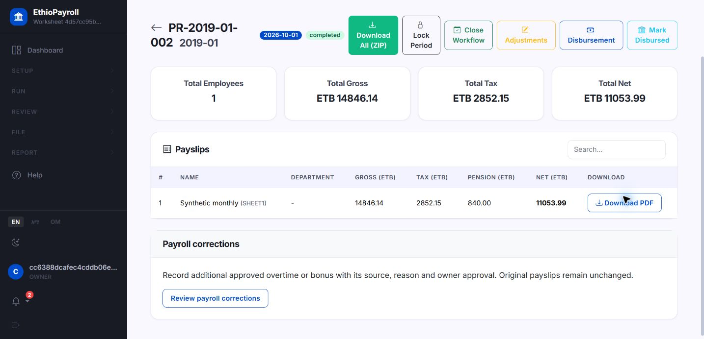
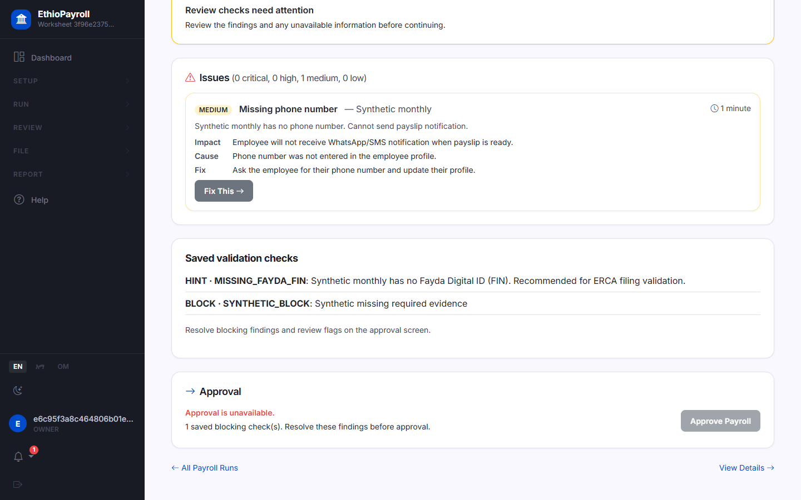
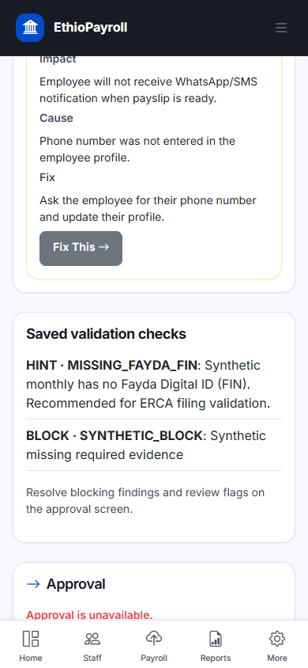

# Ordinary monthly payroll journey - 2026-10-03

## Current merge receipt - 2026-10-04

PR #11 is merged with explicit user approval. Remote main is
`2f6f4e6c66726bbe5fbcd8a5bc6f51fe8fdc6110`; its tree is identical to reviewed
PR head `6eb7fd13037741b18b4dfa8d3ec7a9d24360abf9`.
On that exact head, Python 3.11 and 3.12 each completed:
`TOTAL: 1563 passed, 0 failed, 0 errors, 124 skipped`.
PostgreSQL: `128 passed, 286 warnings in 66.04s (0:01:06)`.
Lint/format, both standalone migration jobs and GitGuardian also passed.

Merge-SHA Python 3.11/3.12, PostgreSQL, lint/format and both standalone migration
jobs completed successfully. There is no separate
GitGuardian check on the merge object. No deployment or new feature began.
This receipt is a documentation-only follow-up on the existing feature branch;
remote main and tested source remain unchanged. Earlier unmerged/pending records
below are historical checkpoints. Founder/Tigist trial and release/policy limits
remain open; the scripts below are the next preparation target.

## Historical scope and authoritative state at implementation start

Accepted remote main is `9670a92487c705a6614e3c6df67aff24d29c7bcf`.
PR #8 recovery/hardening reconciliation and PR #10 overtime/bonus corrections
are already merged. No newer main commit was returned by the remote read.
Alembic: 77 revisions, sole head `f4a5b6c7d8f3`. This slice adds no migration,
statutory formula, correction category, payment execution or AI.

Exact-main hosted results: PostgreSQL, standalone migrations Python 3.11/3.12,
and lint/format pass; full Python 3.11 failed with
`TOTAL: 1550 passed, 11 failed, 0 errors, 116 skipped`; Python 3.12 cancelled.
[Main CI](https://github.com/vouge2017/ethiopian_payroll_engine/actions/runs/37105301824).
The eleven failures were reproduced locally and concern obsolete correction
API/unsupported-treatment expectations and the replaced uniqueness constraint.
Tests now enforce the accepted retained-period addition contract, reject
unsupported treatments, and inspect the regular-only partial unique index.
The existing actual duplicate insert and real PostgreSQL concurrency cases remain.

GitGuardian passed on PR #10 head `90779cb` (check `111152463105`). There is no
separate GitGuardian check on merge SHA `9670a92`; absence is not a passed scan.
Deployment, restore proof and founder/Tigist acceptance are unverified.

Implementation is on `feature/monthly-payroll-journey` in
`D:\ethiopian_payroll_engine\payroll-pr8-integration`, preserving the earlier
dirty folders. The final commit identity/push status accompanies this report in
the handoff; this report is committed with the implementation. It is unmerged.

## Delivered behavior

1. Approved regular payslips expose Generate PDF before a file exists and
   Download PDF afterwards, using the existing authorized generation route.
2. Worksheet results do not offer the unsupported Undo action. Confirmation
   explains the restriction and the existing separate evidenced correction path.
   Legacy Undo behavior and its money guards are unchanged.
3. Completed/locked review correctly says Approved/Approved and locked and links
   to approved outputs. It does not invite a second approval or call an approved
   run Ready for Approval / Issues Must Be Resolved.
4. The obsolete results correction form (deduction/net override, lacking required
   evidence) is replaced with a link to the already merged correction screen.
   No new correction treatment is enabled.

Worksheet review now connects the existing `change_summary` builder to its saved
draft and the most recent earlier approved company payroll, selected by date,
not insertion ID. Future, same-month and unapproved runs do not qualify.
Only regular payslips enter this comparison; supplemental corrections are
separate, preventing one correction from replacing an employee's normal figures.

Exact gross/net, retained basic salary, bonus, overtime pay, other deductions/
recoveries and leave deductions are displayed. Added/absent employees are shown
without assuming a resignation merely from payroll absence. Previous worksheet
identity comes from the retained snapshot, including a subsequently deleted
employee. Later master changes do not rewrite a saved review or its comparison.
Missing/inconsistent prior worksheet snapshots surface an error and remove the
Continue to approval control. Legacy payroll without detailed retained inputs
compares approved gross/net/tax and explicitly does not infer old basic/bonus/
overtime/deduction details; its identity may fall back to current master data.

Existing exception checks and saved validation findings appear with the review.
Negative net and blocking saved findings prevent the Continue control; existing
backend approval protections remain. Missing payment identity is checked against
the saved worksheet bank value, so editing today's master does not silently
repair an already frozen review. Refresh an unsubmitted review to include fixes.

No new materiality threshold was introduced. All exact changes are visible.
The worksheet connection does not inherit the old summary's 5/20-percent variance
heuristics. Existing statutory/validation rules remain unchanged; their policy
acceptance is separate. Practitioner decision needed: which amount/percentage
change should receive a company warning, and what evidence should accompany it?

## Local verification and failures corrected

- Before repair, the two CI files reproduced
  `11 failed, 21 passed, 4 warnings in 9.67s`.
  Log: `local-evidence/integration-20261003-165148-567699.log`.
- Initial focused runs caught a test-message mismatch, an incorrectly simulated
  historical month and a wrong assumed overtime expectation. Fixtures/assertions
  were repaired; the ordinary current-month endpoint and calculator were not
  broadened or changed to make these tests pass.
- Affected selection:
  `136 passed, 104 warnings in 80.49s (0:01:20)`.
  Log: `local-evidence/integration-20261003-171255-474699.log`.
  Exact files: `test_p0_features`, `test_p0d_concurrency`, `test_change_summary`,
  `test_exceptions`, `test_error_boundaries`, `test_pg_monthly_journey`,
  `test_pg_worksheet_journey`, `test_pg_published_register`,
  `test_pg_accounting_outputs`, `test_pg_deduction_identity`, under `tests/`.
- Final recheck after the stale results form was replaced:
  `57 passed, 20 warnings in 20.60s`.
  Log: `local-evidence/integration-20261003-172413-826451.log`.
  Exact files: `test_pg_monthly_journey`, `test_p0_features`,
  `test_p0d_concurrency`, `test_correction_math`, `test_gate_payslip_unique`.
- Eight new migrated PostgreSQL cases cover retained changes, added/removed
  employees, tenant scope, date selection, correction exclusion, first baseline,
  PDF/status/Undo controls, negative net, frozen missing bank, saved blocking
  findings, missing prior snapshots and declared legacy limitations.
- Runner: locked Python 3.12, `local-evidence/run_integration_checks.py`, `-q`,
  cache disabled and isolated test temp paths. Native PostgreSQL control target
  `127.0.0.1:55439/payroll_pr8_20261003`; fixtures create/delete only their new
  synthetic tenants. Browser uses its own generated disposable database.
- Ruff: `ruff check payroll_engine/ tests/` passes;
  `ruff format --check payroll_engine/ tests/`: `231 files already formatted`.

Selections overlap; do not add counts. These are local changed-path receipts.

Pushed implementation: `9f0f4a3e1613cb36a2eb14bced55915b8827982b`.
[Hosted branch CI](https://github.com/vouge2017/ethiopian_payroll_engine/actions/runs/37130741492)
includes the new PostgreSQL file. PostgreSQL passed:
`128 passed, 286 warnings in 69.69s (0:01:09)`, with empty-database migration
and rollback/rollforward verified. Lint/format and strict security/tenant gates
on Python 3.11/3.12 passed. Both full Python jobs completed successfully, each:
`TOTAL: 1561 passed, 0 failed, 0 errors, 124 skipped`.
All four hosted jobs are green on this exact implementation SHA.
There is no attached GitGuardian check; the earlier PR #10 scan is separate.
Hosted logs: `local-evidence/hosted-pg-9f0f4a3.log`,
`local-evidence/hosted-python311-9f0f4a3.log`,
`local-evidence/hosted-python312-9f0f4a3.log`.

The follow-up receipt commit changes only this report, STATUS.md and WORK_ORDERS.md.
Its `[skip ci]` marker avoids repeating completed suites for a documentation-only
update. Source, tests, migrations and workflow are identical to tested `9f0f4a3`;
there is no separate hosted run attributed to that documentation commit.

## Browser evidence

A CSRF-enabled loopback preview exercised accountant Submit to owner, waiting
state, owner password confirmation, one approval, results, individual PDF
generation/download, bank spreadsheet download and completed review label.
Synthetic example: previous gross/net 12,000.00 / 9,260.00; current basic 12,000,
bonus 500, overtime 346.14, recovery 100; current gross/net
**14,846.14 / 11,053.99**. All six exact changes were visible.
Downloaded PDF and bank workbook were parsed and both matched net 11,053.99.
Payment status stayed Pending. No external payment or filing was executed.

Desktop and 390-pixel phone widths were exercised. Measured page width 384 was
within the 390 viewport. The saved table scrolls within its container; comparison
text wraps. Final phone results screenshot export failed when browser access
ended; phone control observations and PostgreSQL rendering assertions remain
valid. The readable saved phone review screenshot and desktop results are below.
The preview is stopped and its successful generated database cleaned up.

## Remaining policy and release limits

### Independent follow-up review - 2026-10-04

The earlier hosted receipt belongs to implementation `9f0f4a3`. Today's bounded
review found and repaired misleading success/blocker text on saved BLOCK or
missing comparison data, and recovery-only changes described as unchanged by
the API/cockpit narrative. Retained comparisons now use neutral Added to payroll /
Absent from payroll labels. Pending owner approval has its own header label.
Legacy narrative behavior and all money-writing services remain unchanged.

Final focused regression: `74 passed, 20 warnings in 47.54s`, including all eight
PostgreSQL monthly cases; Ruff passes with `231 files already formatted`.
Independent review of the fixes found no remaining blocker within those four
source/test files. New code needs its own hosted CI, distinct from earlier green.

Cached Playwright CLI checked the synthetic blocked review at 1440px and 390px.
The blocker count, disabled approval and lack of false success text agreed;
page width matched viewport. The phone capture shows the checks list, with the
approval section further down the page. No new packages were installed.

**UI/UX assessment:** functional evidence is sufficient for continued bounded
review, not proof of practitioner usability. The page is long, the saved payroll
table needs horizontal scrolling on phones, employee change entries repeat names,
and technical checker codes remain visible. Prioritize clearer exception/next
action placement and plain wording using founder/Tigist observations; no broad
redesign was performed. Amharic and keyboard/accessibility acceptance remain
unverified in this slice. Current synthetic rendering is not a persistent demo.

Practitioner acceptance remains necessary for exemption caps, joining/leaving
and daily-worker/proration rules, account mappings, historical statutory
identity/classification, bank/filing format acceptance and materiality warnings.
Current worksheet UI prepares the current Gregorian month only; this slice
does not implement previous-period editing, reopening, cutoff or late-input
workflows. Other correction treatments remain outside the accepted slice.

Before real-money use: identify deployment SHA/schema, inspect a staging backup
for duplicates/drift, verify shared web/worker keys, durable PDF/job recovery,
backup/restore including keys, and required hosted checks. These are open gates,
not new implementation tasks authorized here. There is no production-ready claim.

## Founder synthetic trial script

Use an isolated synthetic company with one previously approved month. An engineer
must start that environment; the temporary browser fixture is not a deployment.

1. As accountant, save the next month's bonus/overtime/recovery and reopen review.
   Confirm the saved amounts persist and the six old-to-new changes explain them.
2. Inspect exceptions and saved checks. Demonstrate missing bank/negative net or
   a blocking finding; resolve via source inputs and refresh before submission.
3. Submit to owner; verify accountant sees Waiting for owner approval. As owner,
   verify amounts, confirm with password, and approve once. Retry must add no
   second payslip or loan consumption (already automated on PostgreSQL).
4. Download individual PDF and bank file. Check the same net appears in review,
   approved results and both files. Confirm Approved label, no worksheet Undo,
   and Pending payment. Record unclear wording/actions rather than real data.

## Tigist/practitioner synthetic trial script

1. Give Tigist two synthetic month records and approved source notes. Ask her to
   prepare the second month and explain the salary, bonus/overtime and recovery
   differences without developer coaching.
2. Ask which exceptions require action, which require owner judgment and which
   are informational. Record any missing real-office decision and agreed policy;
   do not accept invented legal treatment or silently choose warning thresholds.
3. Have her submit to an owner, obtain the approved outputs and reconcile totals.
   Ask where she hesitated, what she would normally check outside the system,
   and whether the comparison gave enough evidence to proceed.

**STOP:** technical slice only. No practitioner expansion, AI, automatic bank
execution, statutory submissions, HRMS expansion, new correction categories or
production deployment begins automatically after this handoff.
