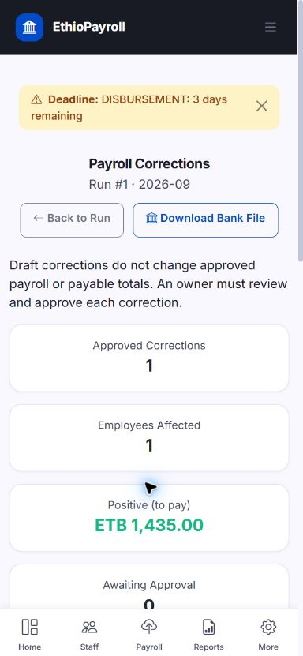

# Approved-payroll corrections — 2026-10-03

Base: merged main `9a46f2880188c7bb473bd3ac1c42fd89053bf839`.
Branch: `feature/approved-payroll-corrections`.
Workspace: `D:\ethiopian_payroll_engine\payroll-correction-work`.

## Delivered workflow

An owner or accountant records additional taxable overtime or bonus, its approved
source, supporting reference, effective date and reason. Saving creates an audited
draft, with no payslip or payable amount. An owner explicitly approves or rejects
it. Approval atomically creates a linked adjustment payslip and audit event;
the original approved payslip and deduction balances stay unchanged.

New worksheet reviews freeze the actual progressive tax brackets and employee
identity used in calculation. Approval retains that context. The elements-based
legacy approval path also records its calculation context. Precomputed legacy
figures without sufficient context are not given invented snapshots.

A correction uses retained taxable income and brackets: tax on corrected
period income minus previously recognized tax. Subsequent approved corrections
are included in that baseline. It does not calculate tax on an isolated extra
payment or use today's salary, rule configuration or bank details. The correction
effective date must fall within the retained calculation window. This does not
reinterpret ambiguous legacy calendar/period records.

The source reference uniquely identifies a correction for the original payslip,
even if a retry changes source classification. Identical retries return the same
record; conflicting details are rejected. PostgreSQL locks serialize draft and
approval attempts. One draft per original is allowed, while separate later
approved corrections remain possible. Active membership is required, including
when the user's legacy default-company role would otherwise grant access.

Only approved corrections enter this correction bank file. Multiple unpaid
corrections for one employee/account are summed; paid corrections are excluded.
Invalid retained CBE instructions block export. PDF and register outputs use
the approved delta and retained identity. The PDF explains the tax difference
without consulting current tax rules. Downloading a file does not mark payment.

## Schema and preservation

Revision `f4a5b6c7d8f3` follows `f4a5b6c7d8f2`; the graph has 77 revisions and one
head. It adds a nullable payslip calculation context and a tenant-scoped correction
table with provenance, decision metadata, snapshots and issued-payslip links.
Composite foreign keys reject cross-company payslip links. Database checks reject
an approved correction without its approver, approval time and issued payslip.

Regular payslip uniqueness remains enforced by a partial unique index. The old
one-adjustment-per-employee constraint is replaced so distinct, linked approved
corrections can coexist. Existing payslips and amounts are preserved, with no
historical context backfill. A downgrade refuses to discard correction history
or retained calculation context before executing any destructive DDL.

Existing dirty mobile/UI workspaces were left untouched. The outer repository
locally excludes this worktree to prevent another accidental nested repository
commit. No production database was used or deployment performed.

## Evidence

The reproduction against merged-main source deliberately failed:

`1 failed, 4 warnings in 2.22s`

It expected period tax delta ETB 565.00; the old isolated calculation returned
ETB 0.00. Log: `local-evidence/integration-20261003-081205-461562.log`.

Affected migration, worksheet, accounting, register, PDF and approval selection:

`118 passed, 132 warnings in 142.72s (0:02:22)`

Log: `local-evidence/integration-20261003-081955-261146.log`.

The subsequent security/correction batch reported:

`1 failed, 121 passed, 12 warnings in 162.44s (0:02:42)`

The sole failure was a new test mocking nonexistent `tasks.enqueue_pdf`; the
security files passed. Removing that mock and rerunning the correction selection
reported:

`38 passed, 5 warnings in 58.61s`

Log: `local-evidence/integration-20261003-090948-866790.log`. Later bank guards
and the additional bank-output regression are recorded in the final checkpoint.
Selections overlap; these numbers are not summed or described as a fresh full
suite. Initial fixture failures and the PDF explanation defect were repaired.
All raw logs and the verbatim reviewed diff remain under ignored `local-evidence/`.

Final checkpoint after bank validation and aggregation:

`39 passed, 5 warnings in 97.16s (0:01:37)`

Log: `local-evidence/integration-20261003-093539-216199.log`. Ruff check passed;
format check reported `230 files already formatted`. Source preflight found no
graph/source problems; it is separate from the actual PostgreSQL proof above.

PostgreSQL cases cover empty/prior-data upgrade, downgrade/upgrade, preserved
financial amounts, actual uniqueness/foreign-key/approval checks, concurrent
drafts and approvals, retries, conflicting evidence, revoked/foreign access,
audit rollback, historical context refusal, cumulative corrections, changed
master data, PDF text, bank totals and populated-history downgrade refusal.
Generated test databases have unique names; the supplied connection is only the
control connection for this new test module.

The CSRF-enabled browser journey saved a draft at ETB 0 payable and approved it
at ETB 1,435 payable (gross addition ETB 2,000; tax difference ETB 565). Desktop
and 390px phone layouts were inspected. The phone approval card was reachable;
document width 384px did not exceed its 390px viewport. Data is synthetic.

[Desktop screenshot](evidence/correction-desktop-2026-10-03.jpg).

## Explicit limits and next work

Only additional taxable overtime/bonus is automated in this slice. Salary,
pension, deductions, recovery and net-only corrections require separate policy
acceptance. Older payroll without complete retained context, non-reconciling
history, and unclassified legacy adjustments require historical review.
Legacy adjustment records are preserved and flagged; they are not automatically
treated as approved corrections in the new bank file.

This is not legal certification, bank integration, settlement confirmation or
production readiness. Hosted checks, practitioner feedback, deployment and
restore evidence remain separate. Next implementation work is the existing
results/review UI defects and the synthetic practitioner journey.
